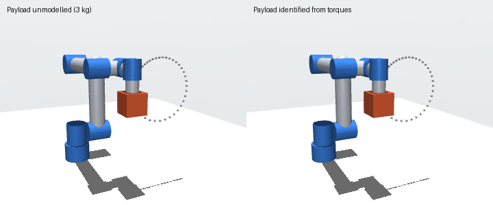

# Manipulator Dynamics, Identification & Control from Scratch

Rigid-body dynamics (RNEA, CRBA, ABA), kinematics, inverse kinematics, payload
identification and five torque controllers for a 6-DOF arm, written from first
principles in NumPy. **Every algorithm is verified against MuJoCo's C implementation
to within 1e-11**, and every controller is evaluated in closed loop in MuJoCo at 1 kHz
under the UR5e's torque limits.



*Left: operational-space control with an unmodelled 3 kg payload sags off the reference
circle (grey). Right: after identifying the payload from joint torques, it tracks to
0.13 mm RMS.*

## Results at a glance

| | Result |
|---|---|
| Dynamics correctness | RNEA, CRBA, ABA, FK, Jacobian and J̇q̇ match MuJoCo to within 1e-11 over 2,000 arm states and 50 random branching trees ([validation](results/validation.md)) |
| Model-based control | Computed torque tracks a 3-move, all-joint trajectory to **0.005° RMS**, vs 1.49° for PD and 0.25° for PD + gravity compensation at the same bandwidth |
| Robustness | An unmodelled 3 kg payload degrades computed torque to 1.41° and operational-space control to 25 mm |
| Payload identification | Least squares on one logged move recovers the payload's mass to within 1 g and centre of mass to within 2 mm (0.5 N·m torque noise), restoring **0.018°** / **0.13 mm** tracking |
| Inverse kinematics | Error-damped Levenberg–Marquardt with restarts solves **100%** of 300 random 6D targets in about 26 ms each; the pseudo-inverse solves 41% and takes 10¹⁰ rad steps near singularities ([benchmark](results/ik_benchmark.md)) |

## What is implemented

| Module | Contents |
|---|---|
| [`spatial.py`](armctl/spatial.py) | 6D spatial vector algebra (Plücker transforms, spatial cross products, spatial inertia), SO(3) log/exp robust at 0 and π |
| [`robot.py`](armctl/robot.py) | Kinematic-tree model (revolute joints, welded bodies, offset joint axes, armature) built from an MJCF file |
| [`kinematics.py`](armctl/kinematics.py) | Forward kinematics, geometric Jacobian, analytic J̇q̇, IK (Newton, damped least squares, Levenberg–Marquardt, random restarts) |
| [`dynamics.py`](armctl/dynamics.py) | Recursive Newton–Euler (inverse dynamics, O(n)), Composite Rigid Body Algorithm (mass matrix), Articulated Body Algorithm (forward dynamics, O(n)) |
| [`identification.py`](armctl/identification.py) | Payload regressor Y(q, q̇, q̈) from the linearity of dynamics in inertial parameters; batch least-squares identification |
| [`trajectory.py`](armctl/trajectory.py) | Quintic rest-to-rest joint trajectories; Cartesian circle with quintic phase timing |
| [`controllers.py`](armctl/controllers.py) | PD, PD + gravity compensation, computed torque, Jacobian-transpose PD, operational-space control |
| [`sim.py`](armctl/sim.py) | MuJoCo closed-loop harness with torque saturation and logging |

MuJoCo is used for two things only: parsing the MJCF model into arrays, and acting as
ground truth and as the "real robot" in simulation. None of the algorithms above call it.

## How correctness is established

- **Against MuJoCo** ([`validation.py`](armctl/validation.py)): forward kinematics vs
  `site_xpos`, Jacobian vs `mj_jacSite`, J̇q̇ vs `mj_jacDot`, RNEA vs `mj_inverse`,
  CRBA vs `mj_fullM`, ABA vs `mj_forward`.
- **Beyond one robot**: 50 randomly generated kinematic *trees* with branching, arbitrary
  joint axes, axes offset from the body origin, rotated inertias and armature, so that
  nothing about the UR5e's layout is baked in.
- **Physics identities** ([`tests/`](tests)): M(q) symmetric positive definite,
  RNEA ∘ ABA = identity, and power balance d/dt(T + V) = q̇ᵀτ.
- `pytest` runs 21 tests in about 13 s.

## Controller comparison

All controllers get the **same nominal bandwidth** (ωn = 20 rad/s, ζ = 1). PD gains are
scaled by the diagonal of M(q) (or of the task inertia Λ) at the home pose, so the
comparison measures what model-based compensation buys, not who has larger gains.

| Joint-space tracking | Exact model | Unmodelled 3 kg payload |
|---|---|---|
| PD | 1.49° | 3.05° |
| PD + gravity compensation | 0.25° | 1.86° |
| Computed torque | 0.0053° | 1.41° |
| Computed torque + identified payload | — | 0.018° |

| Task-space tracking (tool position, RMS) | Exact model | Unmodelled 3 kg payload |
|---|---|---|
| Jacobian-transpose PD + gravity | 7.7 mm | 19.3 mm |
| Operational space | 0.12 mm | 25.3 mm |
| Operational space + identified payload | — | 0.13 mm |

The result worth noticing is that with a wrong model, operational-space control does
*worse* than the simpler Jacobian-transpose controller (25.3 vs 19.3 mm): a model-based
controller is only as good as its model. Identifying the model fixes it.
Full tables, torque usage and the identification noise sweep are in
[results/controllers.md](results/controllers.md).


## Run it

```bash
pip install -r requirements.txt
pytest                                   # 21 tests, ~13 s
python scripts/validate_dynamics.py      # -> results/validation.md
python scripts/benchmark_ik.py           # -> results/ik_benchmark.md   (~2 min)
python scripts/compare_controllers.py    # -> results/controllers.md + plots (~1 min)
MUJOCO_GL=osmesa python scripts/render_demo.py   # -> results/demo.gif (MUJOCO_GL=egl or unset on a desktop)
```

## Design decisions and limitations

- **Spatial (6D) algebra in body coordinates**, following Featherstone, so RNEA, CRBA and
  ABA share one set of primitives. Derivations are in [docs/THEORY.md](docs/THEORY.md).
- **Computed torque is a single RNEA call**: M(q)v + h(q, q̇) is inverse dynamics
  evaluated at q̈ = v, so M is never formed.
- **The arm is UR5e-style**: kinematic and inertial parameters follow Universal Robots'
  public description, geometry is simplified, and there is no joint friction, motor
  dynamics or sensor delay. These are the obvious next steps toward hardware.
- **Pure Python** is about 100× slower than MuJoCo's C (RNEA ≈ 300 µs vs 3 µs). The
  algorithms are O(n); the gap is interpreter overhead.
- **Identification** estimates all 10 inertial parameters but does not enforce physical
  consistency (e.g. positive-definite inertia); mass and centre of mass are what the
  excitation move determines well.
- **6 joints, 6D task**: there is no redundancy, so operational-space control has no
  null space here. A 7-DOF arm would add null-space posture control.

## References

- R. Featherstone, *Rigid Body Dynamics Algorithms*, Springer, 2008.
- K. M. Lynch and F. C. Park, *Modern Robotics*, Cambridge University Press, 2017.
- B. Siciliano, L. Sciavicco, L. Villani, G. Oriolo, *Robotics: Modelling, Planning and Control*, Springer, 2009.
- O. Khatib, "A unified approach for motion and force control of robot manipulators: the operational space formulation," *IEEE J. Robotics and Automation*, 1987.
- T. Sugihara, "Solvability-unconcerned inverse kinematics by the Levenberg–Marquardt method," *IEEE Trans. Robotics*, 2011.
- C. G. Atkeson, C. H. An, J. M. Hollerbach, "Estimation of inertial parameters of manipulator loads and links," *IJRR*, 1986.
