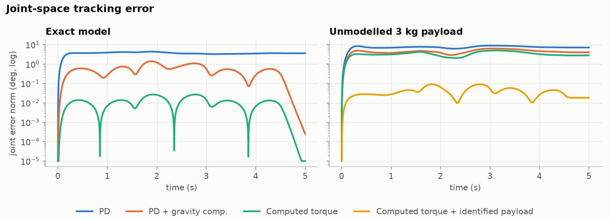
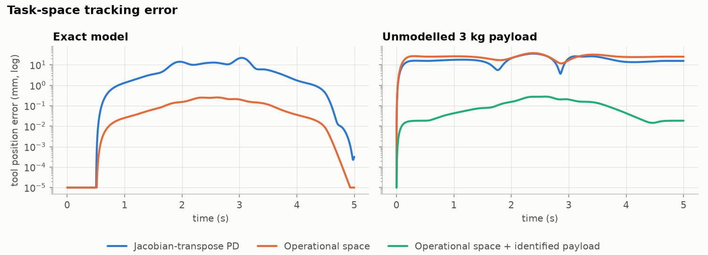
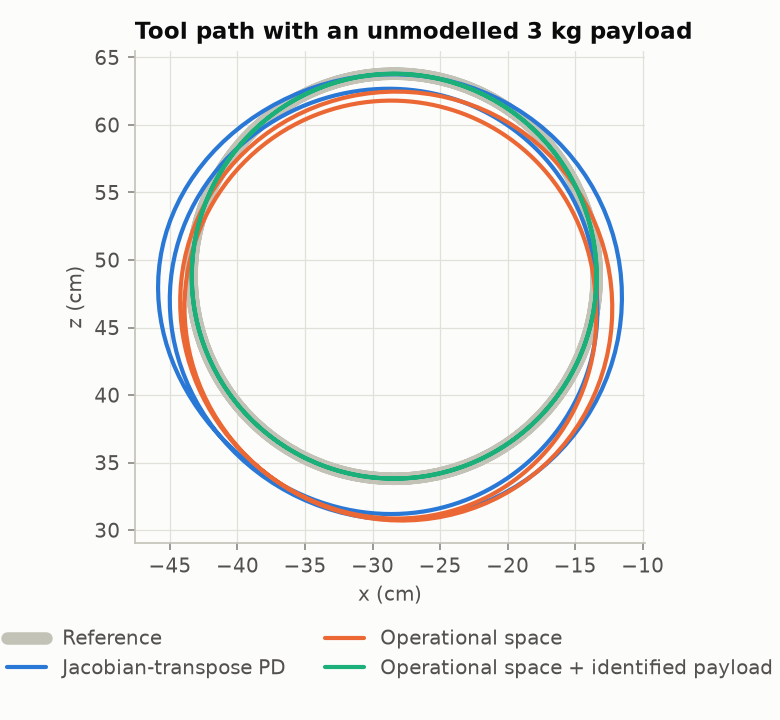

# Controller comparison

All controllers share the same nominal bandwidth (ωn = 20 rad/s, ζ = 1); PD gains are scaled by the diagonal of M(q) (or of the task inertia Λ) at the home pose, so differences come from model-based compensation, not larger gains. Simulated at 1 kHz in MuJoCo, torques clipped to the UR5e ratings (150 N·m / 28 N·m).

## Joint-space tracking

Three 1.5 s rest-to-rest moves through all six joints (up to 2.75 rad/s and 5.7 rad/s²; the UR5e limit is 3.14 rad/s).

| Model | Controller | RMS joint error | Max joint error | RMS tool-point error | RMS torque | Saturated |
|---|---|---|---|---|---|---|
| Exact model | PD | 1.49° | 3.11° | 40.9 mm | 11.1 N·m | 0% |
| Exact model | PD + gravity comp. | 0.25° | 0.985° | 4.18 mm | 10.8 N·m | 0% |
| Exact model | Computed torque | 0.00534° | 0.0156° | 0.065 mm | 10.8 N·m | 0% |
| Unmodelled 3 kg payload | PD | 3.05° | 6.27° | 76.2 mm | 19.5 N·m | 0% |
| Unmodelled 3 kg payload | PD + gravity comp. | 1.86° | 4.89° | 38.8 mm | 19.4 N·m | 0% |
| Unmodelled 3 kg payload | Computed torque | 1.41° | 3.53° | 26.8 mm | 19.3 N·m | 0% |
| Unmodelled 3 kg payload | Computed torque + identified payload | 0.0182° | 0.09° | 0.0579 mm | 19.4 N·m | 0% |

## Payload identification

Dynamics are linear in a body's inertial parameters, so the payload's 10 parameters (mass, first moments, inertia about the flange origin) follow from least squares on one logged run of the move above: τ_measured − RNEA_nominal = Y(q, q̇, q̈) π. Measured torques carry 0.5 N·m Gaussian noise and q̈ comes from numerically differentiating q̇, as on a real robot. Regressor condition number: 12.

| Parameter | True | Estimated |
|---|---|---|
| m | 3.0000 | 2.9994 |
| m*cx | 0.0000 | -0.0015 |
| m*cy | 0.4500 | 0.4541 |
| m*cz | 0.0000 | 0.0014 |

Mass error 0.6 g, centre-of-mass error 1.6 mm. The 6 inertia terms are estimated too but are weakly excited by this move and matter little here.

### Sensitivity to torque-sensor noise

| Torque noise (std. dev.) | Mass error | COM error | Computed-torque RMS error after identification |
|---|---|---|---|
| 0 N·m | 0.2 g | 0.1 mm | 0.00574° |
| 0.5 N·m | 0.6 g | 1.6 mm | 0.0182° |
| 1 N·m | 1.4 g | 3.1 mm | 0.0287° |
| 2 N·m | 3.0 g | 6.1 mm | 0.0478° |

## Task-space tracking

Two laps of a vertical circle of 15 cm radius in 4 s at fixed tool orientation (peak ≈ 0.9 m/s).

| Model | Controller | RMS position error | Max position error | RMS orientation error | RMS torque |
|---|---|---|---|---|---|
| Exact model | Jacobian-transpose PD | 7.7 mm | 22 mm | 1.53° | 11.1 N·m |
| Exact model | Operational space | 0.121 mm | 0.255 mm | < 0.0001° | 10.9 N·m |
| Unmodelled 3 kg payload | Jacobian-transpose PD | 19.3 mm | 35.5 mm | 1.31° | 20 N·m |
| Unmodelled 3 kg payload | Operational space | 25.3 mm | 37.7 mm | 4.13° | 19.6 N·m |
| Unmodelled 3 kg payload | Operational space + identified payload | 0.129 mm | 0.281 mm | 0.0186° | 19.8 N·m |

